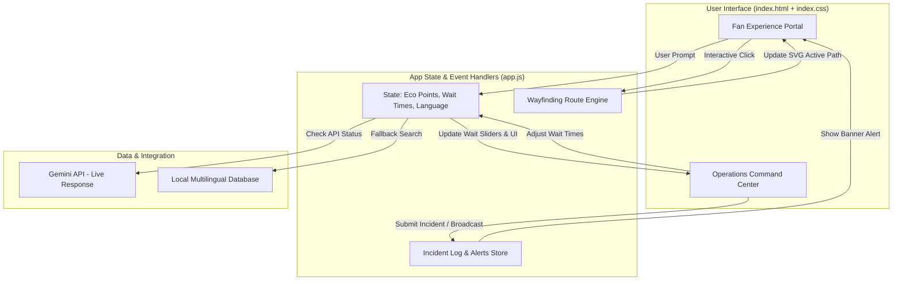
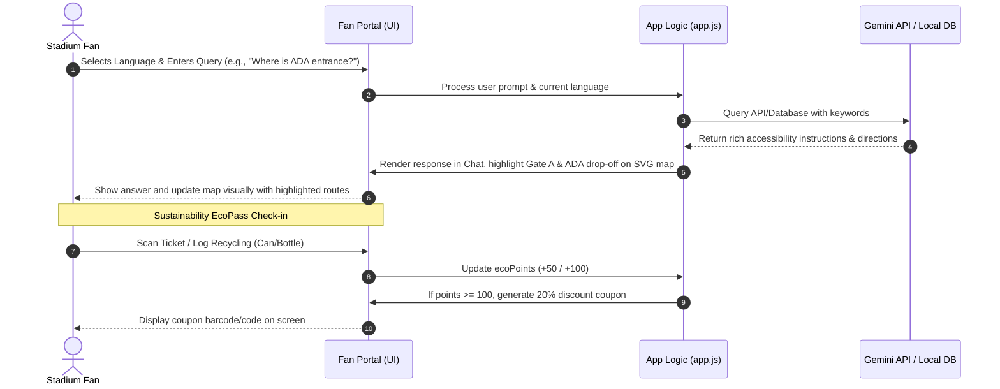
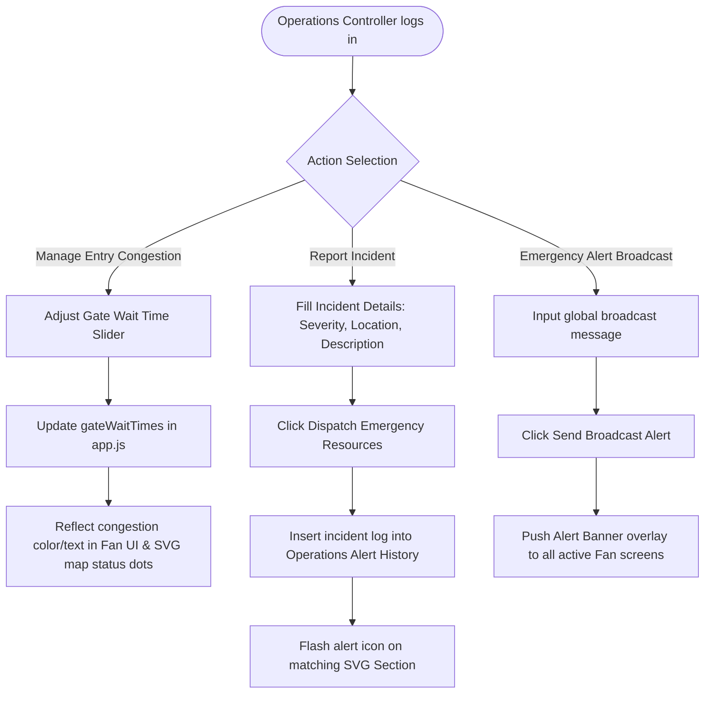

# 🏆 FIFA World Cup 2026 - SmartStadium Operations & Fan Concierge

Welcome to the **SmartStadium-ArenaOps** workspace! This application is a comprehensive web interface designed for the FIFA World Cup 2026 at MetLife Stadium. It features a dual-facing architecture containing a **Fan Experience Portal** for visitors and an **Operations Command Center** for stadium managers.

---

## 🚀 Key Features

### 1. 🤖 Multilingual Fan Concierge
- **Multilingual Support**: Fully localized in English, Spanish, French, and Arabic.
- **Smart Wayfinding Assistance**: Real-time advice on transit options, accessibility hubs, concessions, and entry gates.
- **Gemini API Integration**: Uses the Gemini API for natural language understanding (with local database fallbacks if no API key is provided).

### 2. 🗺️ Interactive Wayfinding Map
- **Interactive SVG Layout**: Clickable zones, gates, parking, and stadium sectors.
- **Layer Switching**: 
  - **Overview Layer**: Default map showing primary layout and navigation paths.
  - **Accessibility Layer**: Highlights elevator hubs, wheelchair ramps, and sensory calming rooms.
  - **Queue Heatmap Layer**: Real-time representation of gate congestion (Green/Yellow/Red).
- **Dynamic Path Navigation**: Draws animated routes from gates to specific seating sectors.

### 3. 🌱 EcoPass Sustainability Rewards
- **Interactive Tracker**: Fans can log recycled PET bottles (+50 pts), Aluminum Cans (+50 pts), or verify a train ticket (+100 pts).
- **Reward Redemption**: Automatically issues a 20% discount coupon valid at concessions when a user reaches 100 points.

### 4. 🎛️ Operations Command Center
- **Gate Wait-Time Controller**: Sliders to adjust simulated gate queue times, updating the Fan UI dynamically.
- **Incident Reporter**: Dispatch logs for medical, security, facility, and tech reports with status tracking.
- **Global Broadcast Dispatcher**: Push immediate emergency alert banners directly to all active Fan screens.

---

## 📐 System Architecture & Workflows

### 1. General System Architecture
This diagram outlines the unidirectional flow between the user interface, internal application state, and external integrations:



---

### 2. Fan Experience & Wayfinding Workflow
This flowchart illustrates the step-by-step sequence of user interaction within the Fan Portal, including AI wayfinding queries and EcoPass milestones:



---

### 3. Operations Management & Incident Response Workflow
This flowchart details how stadium dispatchers manage crowd flows, issue safety broadcasts, and respond to live incidents:



---

## 🛠️ Local Development & Setup

1. **Prerequisites**: Make sure you have [Node.js](https://nodejs.org) installed.
2. **Install Dependencies**:
   Initialize and install server support:
   ```bash
   npm install
   ```
3. **Run the Development Server**:
   Start the local server by running:
   ```bash
   npm start
   ```
4. **Access the App**:
   Open your browser and navigate to:
   ```
   http://localhost:8080
   ```

---

## 🎨 Design System & Styling
- **Core Font**: *Outfit* and *Plus Jakarta Sans* from Google Fonts.
- **Color Palette**: Dark UI theme tailored with glowing colors:
  - Background Dark: `#080c14`
  - Cards: `rgba(17, 24, 39, 0.65)` (Glassmorphic blur)
  - Accent colors: Emerald Green, Dodge Blue, Velvet Purple, Amber Yellow, Coral Red.
- **Layout**: Fully responsive CSS Grid and Flexbox structures optimized for mobile fan devices and wide command center monitors.
